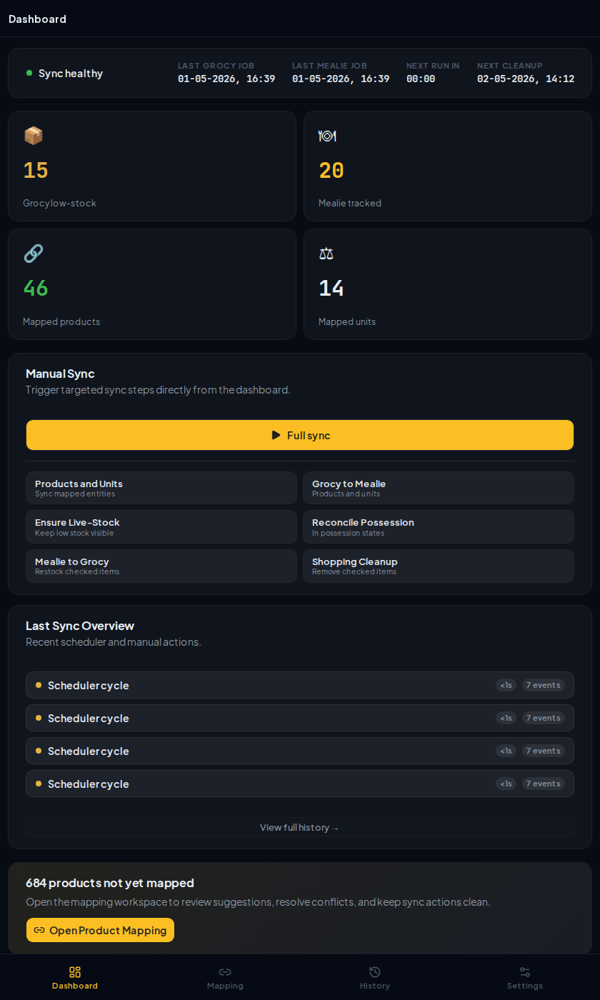

# Grocy-Mealie Sync

Bi-directional sync service between [Grocy](https://grocy.info/) (inventory management) and [Mealie](https://mealie.io/) (meal planning / shopping lists).



## What it does

1. **Product & unit sync** — Matches products and units between Grocy and Mealie by name. Creates missing items in Grocy automatically.
2. **Grocy → Mealie** — When stock drops below minimum in Grocy, the item is added to your Mealie shopping list. Optionally, the app can keep checking that those below-min items still exist as unchecked Mealie list items and recreate them if needed.
3. **Grocy → Mealie possession sync** — For mapped products, Mealie's `In possession` flag can be kept in sync with Grocy stock. You can choose whether any stock above `0` counts, or only stock strictly above `min_stock_amount`.
4. **Mealie → Grocy** — When you check off an item on the Mealie shopping list, stock is added in Grocy and the item is removed from Grocy's shopping list.

The service polls both APIs on a configurable interval (default: 60 seconds).

## Prerequisites

- A running **Grocy** instance (tested with Grocy 4.x)
- A running **Mealie** instance (tested with Mealie v3.12.0)
- **Node.js 22+** (for local dev) or **Docker**
- **VS Code** with the **Dev Containers** extension (optional, for containerized development)

## Setup

### 1. Get API credentials

**Grocy API key:**
- Go to Grocy → Settings (gear icon) → Manage API keys → Add

**Mealie API token:**
- Go to Mealie → User Settings → API Tokens → Create Token

### 2. Configure environment

Copy the example and fill in your values:

```bash
cp .env.example .env
```

See [`.env.example`](.env.example) for the full list of variables and defaults. Set the required values in your local `.env`, especially:

- `GROCY_URL`
- `GROCY_API_KEY`
- `MEALIE_URL`
- `MEALIE_API_TOKEN`

If you use the bundled `compose-dev.yml` for local Mealie development, also set `POSTGRES_PASSWORD`.

### 3. Run

**With Docker (recommended):**

```bash
docker run -d \
  --name grocy-mealie-sync \
  --env-file .env \
  -p 3000:3000 \
  -v grocy-mealie-sync-data:/app/data \
  ghcr.io/harmellis/grocy-mealie-sync:latest
```

**With Docker Compose:**

```yaml
services:
  grocy-mealie-sync:
    image: ghcr.io/harmellis/grocy-mealie-sync:latest
    ports:
      - "3000:3000"
    env_file: .env
    volumes:
      - sync-data:/app/data
    restart: unless-stopped

volumes:
  sync-data:
```

**Local development:**

```bash
npm ci
npm run dev
```

The app runs on `http://localhost:3000`.

**Development with a VS Code devcontainer:**

A ready-to-use devcontainer is included at [`.devcontainer/devcontainer.json`](.devcontainer/devcontainer.json). It provides Node.js 24, forwards port `3000`, and includes Docker CLI access so you can use the local development services from `compose-dev.yml`.

Typical flow:

1. Copy `.env.example` to `.env`.
2. If you want to use the bundled Grocy and Mealie services, set `POSTGRES_PASSWORD` in `.env`, then set `GROCY_URL=http://host.docker.internal:9001` and `MEALIE_URL=http://host.docker.internal:9000`.
3. In VS Code, run `Dev Containers: Reopen in Container`.
4. Inside the devcontainer, start the support services with `docker compose -f compose-dev.yml up -d`.
5. Run `npm run dev`.

If you already use external Grocy and Mealie instances, keep your existing URLs and skip `compose-dev.yml`.

## Docs screenshot workflow

Generate a screenshot locally with:

```bash
npm ci
npm run docs:screenshot
```

This writes `docs/images/app-dashboard.png`.

How the screenshot script works:

- Builds the app, then starts a production preview server on a free local port.
- Captures the real app at `/` with a narrower fixed viewport.
- Opens Chromium in headless mode with a fixed viewport.
- Forces a dark color scheme and reduced motion.
- Waits for the app to hydrate and the settings UI to settle, then disables animations and transitions before taking the screenshot.

### Devcontainer notes

- The devcontainer image installs Debian `chromium`, so `npm run docs:screenshot` works headlessly without X11 forwarding.
- After pulling these changes, rebuild the devcontainer so the new Chromium package is included.
- The devcontainer also sets `PLAYWRIGHT_CHROMIUM_EXECUTABLE_PATH=/usr/bin/chromium` for the screenshot script.

### VS Code Remote SSH notes

- Run the screenshot command on the remote Linux host, not on your local machine.
- If the remote host already has `chromium`, `chromium-browser`, or `google-chrome` installed, the script will use it automatically.
- If no system browser is available, install one on the host or run `npx playwright install chromium` once in the repo.

## Verifying it works

1. Open `http://localhost:3000` — you should see the status dashboard with sync status and settings
2. Check `GET /api/status`:
   - `productMappings` / `unitMappings` should show counts after the initial sync
   - `lastGrocyPoll` / `lastMealiePoll` should update every poll interval

If polls are not updating, check the container/server logs for errors (likely API connection issues).

## API Endpoints

| Method | Path | Description |
|--------|------|-------------|
| `GET` | `/api/health` | Health check |
| `GET` | `/api/status` | Poll timestamps, mapping counts |
| `GET` | `/api/settings` | Current settings and available units |
| `PUT` | `/api/settings` | Update settings (e.g. default unit) |
| `GET` | `/api/mappings/products` | All product mappings (Mealie food ↔ Grocy product) |
| `GET` | `/api/mappings/units` | All unit mappings (Mealie unit ↔ Grocy unit) |
| `POST` | `/api/sync/products` | Manually trigger product & unit sync |
| `POST` | `/api/sync/grocy-to-mealie` | Manually trigger Grocy → Mealie poll |
| `POST` | `/api/sync/grocy-to-mealie/ensure` | Manually ensure all current below-min Grocy products exist on the Mealie list |
| `POST` | `/api/sync/grocy-to-mealie/in-possession` | Manually fully reconcile Mealie `In possession` for all mapped products |
| `POST` | `/api/sync/mealie-to-grocy` | Manually trigger Mealie → Grocy poll |

Manual triggers are useful for testing. The scheduler runs these automatically.

## How the sync works

### Startup
1. Database migrations run automatically
2. Products and units are matched between Grocy and Mealie by name (case-insensitive)
3. Unmatched Mealie items are created in Grocy
4. Mappings are stored in SQLite for subsequent syncs

### Grocy → Mealie (stock below minimum)
- Polls Grocy's volatile stock endpoint for `missing_products`
- Newly missing products are added to the configured Mealie shopping list
- If the item already exists (unchecked) on the list, the quantity is updated instead of creating a duplicate
- When `ENSURE_LOW_STOCK_ON_MEALIE_LIST` is enabled, each poll also checks that every mapped below-min product still has an unchecked Mealie list item and recreates it if needed
- The manual `POST /api/sync/grocy-to-mealie/ensure` endpoint runs that full presence check immediately, even if the setting is disabled

### Grocy → Mealie (`In possession`)
- When `SYNC_MEALIE_IN_POSSESSION` is enabled, each Grocy poll computes the desired Mealie `In possession` state for every mapped product and only writes the differences back to Mealie
- By default, a mapped product is considered `In possession` when Grocy stock is greater than `0`
- When `MEALIE_IN_POSSESSION_ONLY_ABOVE_MIN_STOCK` is enabled, a mapped product is only considered `In possession` when Grocy stock is strictly greater than `min_stock_amount`
- The manual `POST /api/sync/grocy-to-mealie/in-possession` endpoint runs a full reconcile against Mealie's current state immediately, even if the scheduler setting is disabled
- Implementation note: Mealie's current API exposes this state through `householdsWithIngredientFood`, not a dedicated `onHand` field. See [docs/mealie-in-possession.md](docs/mealie-in-possession.md).

### Mealie → Grocy (shopping list check-off)
- Polls Mealie shopping list items for `checked: true` state changes
- Checked items add stock in Grocy (`purchase` transaction)
- The item is also removed from Grocy's shopping list
- Un-checking an item is ignored (no stock removal)
- Items without a linked food (ad-hoc notes) are skipped

## Settings

The following app-level settings can be configured in the web UI at `http://localhost:3000` and via environment variables:

- Mealie shopping list: `MEALIE_SHOPPING_LIST_ID`
- Default unit for new Grocy products: `GROCY_DEFAULT_UNIT_ID`
- Auto-create products in Grocy: `AUTO_CREATE_PRODUCTS`
- Auto-create units in Grocy: `AUTO_CREATE_UNITS`
- Actively ensure below-min items stay on the Mealie list: `ENSURE_LOW_STOCK_ON_MEALIE_LIST`
- Sync Mealie `In possession` from Grocy stock: `SYNC_MEALIE_IN_POSSESSION`
- Only mark Mealie `In possession` above minimum stock: `MEALIE_IN_POSSESSION_ONLY_ABOVE_MIN_STOCK`
- Mapping Wizard min stock input step: `MAPPING_WIZARD_MIN_STOCK_STEP`
- Only restock products with min stock: `STOCK_ONLY_MIN_STOCK`

When one of these environment variables is set, it takes precedence over the stored UI value. The setting is shown as locked in the web UI, and you need to comment out or remove the env var before editing it there.

The Mealie Shopping List ID is the UUID in the URL: `https://mealie.example.com/shopping-lists/<this-uuid>`.

For the default unit, the dropdown only shows units that were synced from Mealie. If `GROCY_DEFAULT_UNIT_ID` points to a Grocy unit that does not have a synced Mealie mapping yet, the sync still uses that Grocy unit ID, but the dropdown cannot represent it.

## Grocy setup tips

For the Grocy → Mealie flow to work, your Grocy products need a `min_stock_amount` greater than 0. When current stock falls below this, the product appears in `missing_products` and gets synced to Mealie.

## Data

All sync state is stored in a SQLite database at the configured `DATABASE_PATH`. The database contains:
- **product_mappings** — Links between Mealie foods and Grocy products
- **unit_mappings** — Links between Mealie units and Grocy quantity units
- **sync_state** — Last poll timestamps, tracked checked items, app settings

The database is created automatically on first run.
