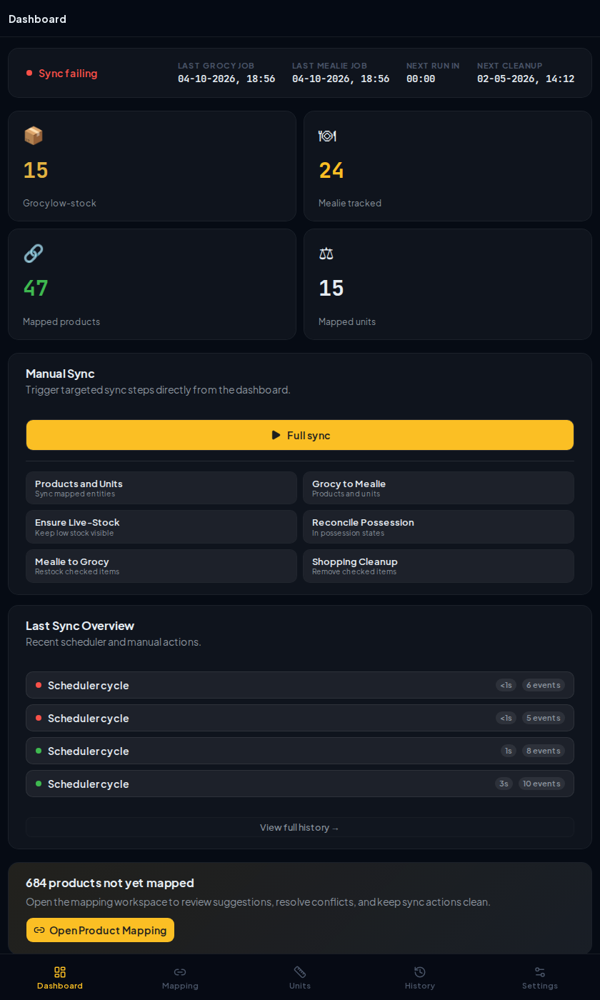

# Grocy-Mealie Sync

Bi-directional sync service between [Grocy](https://grocy.info/) (inventory management) and [Mealie](https://mealie.io/) (meal planning / shopping lists).



## Contents

- [Setup and first run](#setup)
- [Shop plugins and template](#shop-plugins)
- [Barcode scanner](#barcode-scanner)
- [Units & Conversions](#units--conversions)
- [History](#history)
- [Verification and warnings](#verifying-it-works)
- [Authentication](#authentication)
- [Settings](#settings)
- [How the sync works](#how-the-sync-works)
- [Data and backups](#data)
- [MCP Server](#mcp-server)
- [API Endpoints](#api-endpoints)
- [Development](#development)

## What it does

1. **Product & unit sync** — Matches products and units between Grocy and Mealie by name. Can create missing items in Grocy when auto-create is enabled (off by default).
2. **Grocy → Mealie** — When stock drops below minimum in Grocy, the item is added to your Mealie shopping list. Optionally, the app can keep checking that those below-min items still exist as unchecked Mealie list items and recreate them if needed.
3. **Grocy → Mealie possession sync** — For mapped products, Mealie's `In possession` flag can be kept in sync with Grocy stock. You can choose whether any stock above `0` counts, or only stock strictly above `min_stock_amount`.
4. **Mealie → Grocy** — Checking off a mapped item adds Grocy stock and removes it from Grocy's shopping list. The row's amount is converted to the Grocy stock unit first, so "400 g chickpeas" books one 400 g can. By default, only products with a minimum stock greater than zero are restocked.
5. **Retailer shopping lists & receipts** — Optional external shop plugins send open Mealie demand to a retailer list and reconcile digital receipts with Grocy and Mealie.
6. **Barcode scanner** — The companion [grocy-mealie-scanner](https://github.com/HarmEllis/grocy-mealie-scanner) uses this app's device API for purchases, consumption, opening stock and shopping-list requests.

The service polls both APIs on a configurable interval (default: 60 seconds).

## Prerequisites

- A running **Grocy** instance (tested with Grocy 4.x)
- A running **Mealie** instance (tested with Mealie v3.12.0)
- **Node.js 24** (for local dev) or **Docker**
- **VS Code** with the **Dev Containers** extension (optional, for containerized development)

Shared unit standardization requires Mealie 3.13 or newer; on older installations
use the **Grocy only** conversion target. See [Units & Conversions](#units--conversions).

## Setup

### 1. Get API credentials

**Grocy API key:**
- Go to Grocy → Settings (gear icon) → Manage API keys → Add

**Mealie API token:**
- Go to Mealie → User Settings → API Tokens → Create Token

### 2. Configure environment

Copy the example and fill in your values:

```bash
cp .env.example .env
```

See [`.env.example`](.env.example) for the full list of variables and defaults. Set the required values in your local `.env`, especially:

- `GROCY_URL`
- `GROCY_API_KEY`
- `MEALIE_URL`
- `MEALIE_API_TOKEN`

For a production deployment, also set `AUTH_SECRET` and use an HTTPS reverse
proxy for browser access. Generate a secret with `openssl rand -base64 32`.
See [Authentication](#authentication) and [Networking](#networking).

Authentication and optional integration settings:

- `AUTH_ENABLED=true` to require login for the web UI and auth for protected API routes
- `AUTH_SECRET=...` as the shared secret for both the login form and `Authorization: Bearer <token>`
- `DEVICE_API_TOKENS=...` comma-separated tokens for hardware devices (such as [grocy-mealie-scanner](https://github.com/HarmEllis/grocy-mealie-scanner)); these tokens only grant access to the device API under `/api/device/*`
- `MCP_ENABLED=true` to enable the MCP endpoint at `/api/mcp` (default: disabled)
- `MCP_SESSION_TTL_MS=900000` to control MCP session inactivity expiry in milliseconds (default: 15 minutes, min: 60000, max: 86400000)
- `MCP_MAX_SESSIONS=100` to cap concurrent in-memory MCP sessions (default: 100, min: 1, max: 1000)

If `AUTH_ENABLED` is unset, auth turns on automatically when `AUTH_SECRET` is set. Set `AUTH_ENABLED=false` to disable auth explicitly.

If you use the bundled `compose-dev.yml` for local Mealie development, also set `POSTGRES_PASSWORD`.

### 3. Run

**With Docker (recommended):**

```bash
docker run -d \
  --name grocy-mealie-sync \
  --env-file .env \
  -p 3000:3000 \
  -v grocy-mealie-sync-data:/app/data \
  ghcr.io/harmellis/grocy-mealie-sync:latest
```

**With Docker Compose:**

```yaml
services:
  grocy-mealie-sync:
    image: ghcr.io/harmellis/grocy-mealie-sync:latest
    ports:
      - "3000:3000"
    env_file: .env
    volumes:
      - sync-data:/app/data
    restart: unless-stopped
    healthcheck:
      test: ["CMD", "wget", "-qO-", "http://127.0.0.1:3000/api/health"]
      interval: 30s
      timeout: 5s
      retries: 3
      start_period: 60s

volumes:
  sync-data:
```

**Image tags:**

| Tag | Points at |
| --- | --- |
| `latest` | the newest stable release |
| `1`, `1.15` | the newest release in that major / minor line |
| `1.15.0` | that exact release, forever |
| `1.15.0-rc.1` | that exact pre-release, forever |

Pre-releases are published for testing before a release is final. They only ever
get their exact version tag — never `latest`, `1` or `1.15` — so pulling a
moving tag can never hand you a release candidate. To test one, pin it:

```yaml
image: ghcr.io/harmellis/grocy-mealie-sync:1.15.0-rc.1
```

Pre-releases are marked as such on the GitHub releases page and are not
recommended for unattended production use.

**Local development:**

```bash
npm ci
npm run dev
```

The app runs on `http://localhost:3000`.

When auth is enabled, sign in with `AUTH_SECRET` at `/login`. Production browser
sessions use a Secure cookie, so use HTTPS when accessing a server from another
machine. See [Authentication](#authentication).

### Networking

`GROCY_URL` and `MEALIE_URL` must be reachable **from the gm-sync container**.
The example names `grocy` and `mealie` resolve only on a shared Docker network.
Use their internal container ports on that network, or use reachable LAN/proxy
URLs. Inside a container, `localhost` refers to that container itself.

A plugin service in the same Compose project can reach gm-sync by its service
name. For separate Compose projects, create a shared network once:

```bash
docker network create gm-sync-network
```

Add this network declaration to each project's Compose file and attach the
services that need to communicate:

```yaml
services:
  grocy-mealie-sync:
    # Keep the image, environment, ports and volumes from the example above.
    networks: [gm-sync-network]
networks:
  gm-sync-network:
    external: true
    name: gm-sync-network
```

Attach the retailer plugin service to the same network in its Compose file;
then `GM_SYNC_URL=http://grocy-mealie-sync:3000` works. Attach Grocy and Mealie
too if using their service names. For `docker run`, add
`--network gm-sync-network`. Alternatively, a plugin can use a reachable HTTPS
proxy URL; the template converts HTTP(S) to WS(S) and adds `/api/plugins/connect`.

For a reverse proxy:

- Serve the browser UI over HTTPS for production login.
- Forward WebSocket upgrades for `/api/plugins/connect` with an idle timeout
  above the 30-second heartbeat (for example, 60 seconds).
- Overwrite forwarded client-address headers with trusted values; the app uses
  `X-Forwarded-For` for API rate limiting.

### First run

After setup, use [Verifying it works](#verifying-it-works) for connectivity checks.

1. Open **Settings** and select the Mealie shopping list to synchronize.
2. Review **Product Mapping** and the mapping wizard. Resolve product and unit
   mappings before relying on stock writes. Auto-create products and units are
   both off by default; enable them only if you want unmatched items created.
3. Set a positive `min_stock_amount` in Grocy for products that should appear
   on the shopping list when stock runs low. By default, checked-item restocking
   also applies only to products with positive minimum stock.
4. Test with one mapped product: check its Mealie item after a real purchase,
   confirm the stock increase in Grocy, and inspect the change in **History**.
   This test changes real stock; use a test instance for synthetic purchases.
5. Optionally configure [unit conversions](#units--conversions),
   [shop plugins](#shop-plugins), the [scanner](#barcode-scanner) or [MCP](#mcp-server).

`/api/health` returns `503` until startup migrations, scheduler initialization
and the plugin gateway are ready. Increase the Compose healthcheck's
`start_period` if migrations take longer than 60 seconds. Readiness does not
guarantee that Grocy, Mealie or a retailer is reachable; inspect History and
Shopping → Diagnostics for those results.

Deployment note:

- Run a single scheduler instance by default. The app uses a persisted SQLite startup lock so only one instance becomes the active scheduler, plus a separate SQLite lease lock to prevent overlapping sync runs inside that active instance.
- A normal app shutdown releases the locks automatically. If a crashed instance leaves either lock behind, use the `Clear Sync Locks` button in the UI or `POST /api/sync/unlock`.
- There is intentionally no automatic leader election or takeover. After a stale-lock cleanup, restart the app that should own the scheduler.

## Units & Conversions

Open **Units & Conversions** to install metric and US customary definitions from
a shared library. Preview how existing Mealie and Grocy units will be reused,
choose ambiguous units, and explicitly allow creation of missing units before
applying changes. The shared setup adds Mealie's native standard quantities,
matching app unit mappings, and Grocy conversions such as `1 kilogram = 1000 grams`.

Shared standardization requires **Mealie 3.13 or newer**. Older installations can
use the **Grocy only** target. Custom product conversions, import history, and
the same preview/import workflow through MCP are included. See the
[conversion guide](docs/conversions.md) for examples and API contracts.

## Shop plugins

External shop plugins connect retailers: a shared retailer shopping list fed
from open Mealie demand, and digital receipts reconciled with Grocy stock and
the Mealie list. Plugins run in their own container without a web UI or
published port and connect over a WebSocket on the same address and port as
this app (`/api/plugins/connect`). Create a token under **Settings → Shop
plugins** and review everything on the **Shopping** page. Without plugins
nothing changes.

### Connect a retailer

1. Create an installation under **Settings → Shop plugins** and copy its token,
   which is shown only once.
2. Run the retailer plugin in its own container. Set `GM_SYNC_URL` to this app's
   base URL and `GM_SYNC_PLUGIN_TOKEN` to the installation token. Persist the
   plugin's `/data` directory; retailer credentials stay there. See the
   [plugin Compose example](docs/shop-plugins.md#running-a-plugin).
3. Wait for the connected badge under **Settings → Shop plugins**, then use
   **Retailer sign-in** if the plugin supports authentication. The installation
   binds to that retailer account and shopping list. If it stays offline, follow
   the [plugin troubleshooting guide](docs/shop-plugins.md#troubleshooting).
4. Review retailer product mappings on **Shopping → Products**, including the
   amount per package in the target's current unit. Confirm amounts before
   enabling automation.
5. Enable **Sync shared shopping list** and/or **Process receipts** for the
   installation. Both are off by default. Older receipts remain reference-only;
   automatic processing applies from the receipt activation boundary onward.

Mealie demand determines the managed retailer quantities. A deleted managed
product line is restored while Mealie still needs it; remove the Mealie item or
update stock to end that demand. Household quantities are preserved, and
ambiguous quantity changes pause the affected line for review. Receipt processing
credits qualifying manual Mealie checks to avoid booking the same purchase twice.

Receipt retrieval runs every 30 minutes, on reconnect and on plugin hints.
Fetched receipts are processed during the regular sync cycle. **Last receipt
fetch** shows the latest fetch attempt, including failed checks; **Next receipt
fetch** shows the earliest scheduled check across ready installations. List-sync
results, receipt errors and the last shopping job are under
**Shopping → Diagnostics**.

### Build a plugin

Start from the public
[gms-shop-plugin-template repository](https://github.com/HarmEllis/gms-shop-plugin-template)
or the bundled [template README](examples/shop-plugin-template/README.md).
The template contains a synthetic demo retailer, a reusable WebSocket runtime,
durable operation handling and contract tests. Replace the retailer adapter;
gm-sync retains the UI, mappings, unit conversions, list ownership and purchase
reconciliation. Plugins do not call Grocy or Mealie directly. Real retailer
implementations and credentials belong in separate repositories.

See the [shop plugin guide](docs/shop-plugins.md) for setup and recovery, and the
[protocol reference](docs/plugin-protocol.md) for capabilities and wire contracts.
After changing the core protocol, run `npm run plugins:sync-protocol` to update
the bundled template; `npm run plugins:sync-protocol -- --check` checks drift.

Run the app through `npm run dev` or `npm run start`, which use `server.mjs`
to serve the web UI and plugin gateway together. See [Networking](#networking)
for container connections and reverse proxies.

## Barcode scanner

The companion [grocy-mealie-scanner repository](https://github.com/HarmEllis/grocy-mealie-scanner)
contains ESP32 firmware, hardware instructions and a web flasher for a kitchen
barcode scanner. Its **Bought**, **Opened**, **Consumed** and **Shopping** actions
use gm-sync's device API at `/api/device/v1`. Unknown barcodes can be linked to an
existing product or used to create a product through a guided flow.

Set `DEVICE_API_TOKENS` in gm-sync, recreate the container to apply the environment
change, and configure the scanner with the same token and a gm-sync base URL
reachable from its Wi-Fi network. Use a LAN address such as
`http://192.168.1.50:3000` or an HTTPS hostname with a certificate trusted by the
firmware; Docker service names and `localhost` do not identify gm-sync from the
scanner. Device tokens grant access only to `/api/device/*`.
Scanner actions appear in History as **Scanner** actions. The scanner connects
through HTTP rather than the shop-plugin WebSocket and uses a separate token.

See the scanner's [quick start](https://github.com/HarmEllis/grocy-mealie-scanner#quick-start)
for hardware and firmware setup, and its
[device API contract](https://github.com/HarmEllis/grocy-mealie-scanner/blob/main/docs/DEVICE-API.md)
for endpoint details.

## History

History shows individual changes with their product, quantity, source and reason:
checked Mealie items adding Grocy stock, stock shortages updating the Mealie
shopping list, possession flag changes, product mappings and checked-item cleanup.
Scanner purchases, consumption, opening stock, shopping list requests, product
creation and barcode linking are marked as **Scanner** actions.

Search by product name (including either mapped name or sub-product names), or
filter by source, date, and **Changes** / **Errors & warnings**. Each entry links
to the related changes from the same action. Completed writes remain visible
when a later step fails; routine checks without changes are hidden.
Repeated scheduler errors are suppressed between changes or recovery, with a
daily reminder for ongoing failures (every 12 hours with one-day retention).
Older activity is available through pagination. Existing history is preserved, but
older sync summaries cannot supply product details that were never recorded.

`HISTORY_RETENTION_DAYS` controls retention (default: 7 days); `-1` disables
history and clears it on startup.

## Verifying it works

1. Open your gm-sync URL (for local development, `http://localhost:3000`) — you should see the status dashboard with sync status and settings
2. Check `GET /api/status` using your browser session or `Authorization: Bearer <AUTH_SECRET>` when auth is enabled:
   - `productMappings` / `unitMappings` should show counts after the initial sync
   - `lastGrocyPoll` / `lastMealiePoll` should update every poll interval

If polls are not updating, check the container/server logs for errors (likely API connection issues).

### Dashboard sync warnings

When history is enabled, the dashboard headline summarizes the four most recent
history runs, excluding skipped runs from the health assessment. Any failure in
that window shows **Sync failing**; otherwise, any partial run shows **Sync
partially completed**. This includes retailer shopping-list runs. A warning can
therefore remain after a successful retry, until the earlier partial run leaves
the four-run window. It does not necessarily mean a problem is still open.

For example, a retailer may refuse a list operation because a product was already
checked off in its app. The next list sync reads the current list and retries
any remaining work. Check the Shopping page for the latest retailer list-sync
result and History for the affected products. Repeated identical conflicts are
omitted from history events to avoid duplicate warnings, so a partial run may
show only its successful changes while those conflicts recur.

## Authentication

- For a production deployment, set `AUTH_SECRET` (for example, generate one with
  `openssl rand -base64 32`) and serve browser traffic over HTTPS. Without app
  authentication, protected UI/API operations are accessible to anyone who can
  reach the app. Plugin connections still require an installation token.
- Auth is optional and controlled by `AUTH_ENABLED` / `AUTH_SECRET`
- When auth is enabled, the web UI uses a login form and an HttpOnly session cookie
- Programmatic clients can keep using `Authorization: Bearer <AUTH_SECRET>`
- `/api/health` stays public so container health checks keep working
- Shop plugins use their own installation tokens; retailer sign-in stays in the plugin
- Scanner device tokens are configured separately through `DEVICE_API_TOKENS`
- With app authentication enabled, device routes accept a device token or normal
  app authentication. With no app secret but configured device tokens, those
  routes require a device token unless `AUTH_ENABLED=false` was explicitly set.
  Explicitly setting `AUTH_ENABLED=false` opens device routes even when tokens
  are configured; with neither app auth nor device tokens they are open as well.

## Settings

The following app-level settings can be configured on **Settings** and via environment variables:

- Mealie shopping list: `MEALIE_SHOPPING_LIST_ID`
- Default unit for new Grocy products: `GROCY_DEFAULT_UNIT_ID`
- Auto-create products in Grocy: `AUTO_CREATE_PRODUCTS`
- Auto-create units in Grocy: `AUTO_CREATE_UNITS`
- Actively ensure below-min items stay on the Mealie list: `ENSURE_LOW_STOCK_ON_MEALIE_LIST`
- Sync Mealie `In possession` from Grocy stock: `SYNC_MEALIE_IN_POSSESSION`
- Only mark Mealie `In possession` above minimum stock: `MEALIE_IN_POSSESSION_ONLY_ABOVE_MIN_STOCK`
- Mapping Wizard min stock input step: `MAPPING_WIZARD_MIN_STOCK_STEP`
- Only restock products with min stock: `STOCK_ONLY_MIN_STOCK`
- Checked-item cleanup delay in hours (`-1` disables cleanup): `CLEANUP_CHECKED_ITEMS_AFTER_HOURS`
- Checked-item cleanup mode (`all` or `synced_only`): `CLEANUP_CHECKED_ITEMS_MODE`
- Sync sub-products: `SYNC_SUB_PRODUCTS`
- Include a parent's own stock in sub-product synchronization: `SYNC_PARENT_OWN_STOCK`

When one of these environment variables is set, it takes precedence over the stored UI value. The setting is shown as locked in the web UI, and you need to comment out or remove the env var before editing it there.

The Mealie Shopping List ID is the UUID in the URL: `https://mealie.example.com/shopping-lists/<this-uuid>`.

For the default unit, the dropdown only shows units that were synced from Mealie. If `GROCY_DEFAULT_UNIT_ID` points to a Grocy unit that does not have a synced Mealie mapping yet, the sync still uses that Grocy unit ID, but the dropdown cannot represent it.

## How the sync works

### Startup
1. Database migrations run automatically
2. Products and units are matched between Grocy and Mealie by name (case-insensitive)
3. Unmatched Mealie products/units are created in Grocy only when their respective auto-create settings are enabled (both default off)
4. Mappings are stored in SQLite for subsequent syncs

### Grocy → Mealie (stock below minimum)
- Polls Grocy's volatile stock endpoint for `missing_products`
- Newly missing products are added to the configured Mealie shopping list
- The missing amount is a Grocy stock amount, so the row is labelled with the Mealie unit mapped to the Grocy stock unit (`qu_id_stock`); without such a mapping the row has no unit and shows a count
- If an unchecked row for the product already exists in that same unit and did not come from a recipe, its quantity is updated instead of creating a duplicate. Recipe rows and rows in another unit (such as "400 g") are never changed; the sync adds its own row next to them

### Mealie → Grocy (checked items)
- A checked row is booked in the Grocy stock unit. Rows in the stock unit are booked as they are; other units are converted through the app's unit mappings and Grocy's unit conversions, including one intermediate step (`1 kg` → `1000 g` → `1 bag` with a `1 bag = 1000 g` product conversion)
- A row without a unit counts in the stock unit when the product is bought and stocked in the same unit, or when the stock unit counts pieces
- When the amount cannot be converted exactly (no conversion, an empty unit for a product bought in another unit, or the purchase unit of a product stocked in a different unit), nothing is booked and the history shows a warning. Add the stock manually, or add a conversion and uncheck and re-check the row
- When `ENSURE_LOW_STOCK_ON_MEALIE_LIST` is enabled, each poll also checks that every mapped below-min product still has an unchecked Mealie list item and recreates it if needed
- The manual `POST /api/sync/grocy-to-mealie/ensure` endpoint runs that full presence check immediately, even if the setting is disabled

### Grocy → Mealie (`In possession`)
- When `SYNC_MEALIE_IN_POSSESSION` is enabled, each Grocy poll computes the desired Mealie `In possession` state for every mapped product and only writes the differences back to Mealie
- By default, a mapped product is considered `In possession` when Grocy stock is greater than `0`
- When `MEALIE_IN_POSSESSION_ONLY_ABOVE_MIN_STOCK` is enabled, a mapped product is only considered `In possession` when Grocy stock is strictly greater than `min_stock_amount`
- The manual `POST /api/sync/grocy-to-mealie/in-possession` endpoint runs a full reconcile against Mealie's current state immediately, even if the scheduler setting is disabled
- Implementation note: Mealie's current API exposes this state through `householdsWithIngredientFood`, not a dedicated `onHand` field. See [docs/mealie-in-possession.md](docs/mealie-in-possession.md).

### Mealie → Grocy (shopping list check-off)
- Polls Mealie shopping list items for `checked: true` state changes
- Checked mapped items add stock in Grocy (`purchase` transaction); by default,
  `STOCK_ONLY_MIN_STOCK=true` skips products with no positive minimum stock.
  Products configured with no own stock are also skipped.
- When Mealie reports a checked item with quantity `0` or no quantity, the sync intentionally treats it as quantity `1`
- The item is also removed from Grocy's shopping list
- Un-checking an item is ignored (no stock removal)
- Items without a linked food (ad-hoc notes) are skipped

## Data

All sync state is stored in a SQLite database at the configured `DATABASE_PATH`. The database contains:
- **product_mappings** — Links between Mealie foods and Grocy products
- **unit_mappings** — Links between Mealie units and Grocy quantity units
- **sync_state** — Last poll timestamps, tracked checked items, app settings
- **Plugin and Shop state** — Installations and account bindings, retailer mappings,
  observed Mealie demand, export versions and shared-list ownership, stored receipts
  and reconciliation effects
- **History** — Recorded runs and product-level changes and issues

The database is created automatically on first run. Each plugin also needs its own
persistent `/data` volume for retailer credentials and durable operation results;
this is separate from gm-sync's database volume.

In Docker, keep `DATABASE_PATH` under `/app/data` (the default `./data/sync.db`
resolves there). Other locations are rejected by path validation. Bind mounts
must be writable by UID `1001`, which runs the app container.

For a consistent backup, stop gm-sync and its plugins, then back up the complete
gm-sync data directory and each plugin's `/data` together before restarting them.
Preserve the ledger, ownership records and plugin operation caches when restoring;
restoring only one side can make earlier retailer writes uncertain. Store the
environment configuration securely alongside the backup.

## MCP Server

The MCP endpoint is disabled by default. Enable it with:

```text
MCP_ENABLED=true
```

When enabled, the app exposes a Streamable HTTP MCP endpoint at:

```text
http://localhost:3000/api/mcp
```

Use the same app URL when running in Docker or on a remote server.

On startup, the app logs whether the MCP server is enabled or disabled.

The MCP endpoint uses Streamable HTTP sessions:

- create a session with an `initialize` `POST` request (response includes `mcp-session-id`)
- reuse that session ID on subsequent `POST`, `GET`, and `DELETE` requests
- sessions are kept in memory and expire after inactivity (`MCP_SESSION_TTL_MS`)
- `DELETE` closes a session immediately

Operational notes:

- in development, Next.js hot reload recreates the module and clears in-memory MCP sessions
- if session creation traffic is abusive, the in-memory cap can be exhausted until sessions expire or are closed; apply API rate limiting separately when needed

When auth is enabled, connect with:

```text
Authorization: Bearer <AUTH_SECRET>
```

This MCP surface is intended for daily operational workflows across Grocy, Mealie, and this sync app, including:

- product search and combined product overview
- product creation in Grocy, Mealie, or both
- product and unit mapping management, including mapping suggestions
- stock updates and Grocy stock-related product defaults
- Mealie shopping-list correction, including add-by-name flows that can turn phrases like `vanille kwark` into product `kwark` plus note `vanille`
- complete Shop plugin setup and review, including tokens, retailer sign-in, catalogue searches, mappings, receipts and uncertain-write decisions
- product-level history with the same search, date, status and pagination filters as the UI
- conflict, history, and product-state diagnostics

Examples:

- Codex: `codex mcp add grocy-mealie-sync --url http://localhost:3000/api/mcp`
- Claude Code: `claude mcp add --transport http grocy-mealie-sync http://localhost:3000/api/mcp`

## API Endpoints

| Method | Path | Description |
|--------|------|-------------|
| `GET` | `/api/health` | Health check |
| `GET` | `/api/status` | Poll timestamps, mapping counts |
| `GET` | `/api/settings` | Current settings and available units |
| `PUT` | `/api/settings` | Update settings (e.g. default unit) |
| `GET` | `/api/mappings/products` | All product mappings (Mealie food ↔ Grocy product) |
| `GET` | `/api/mappings/units` | All unit mappings (Mealie unit ↔ Grocy unit) |
| `POST` | `/api/sync/products` | Manually trigger product & unit sync |
| `POST` | `/api/sync/grocy-to-mealie` | Manually trigger Grocy → Mealie poll |
| `POST` | `/api/sync/grocy-to-mealie/ensure` | Manually ensure all current below-min Grocy products exist on the Mealie list |
| `POST` | `/api/sync/grocy-to-mealie/in-possession` | Manually fully reconcile Mealie `In possession` for all mapped products |
| `POST` | `/api/sync/mealie-to-grocy` | Manually trigger Mealie → Grocy poll |
| `POST` | `/api/sync/unlock` | Clear persisted scheduler and sync locks manually |
| `POST` | `/api/sync/shopping-cleanup` | Remove eligible checked Mealie items according to cleanup settings |
| `GET` (WebSocket upgrade) | `/api/plugins/connect` | Authenticated connection from an external shop plugin |
| `GET` | `/api/device/v1/ping` | Scanner connectivity and API version check |

The sync POST endpoints can be triggered manually; scheduled execution depends
on the corresponding settings.
Shop setup and review endpoints are documented in the [plugin guide](docs/shop-plugins.md).
Scanner endpoints are specified in the [device API contract](https://github.com/HarmEllis/grocy-mealie-scanner/blob/main/docs/DEVICE-API.md).

## Development

See the [development guide](docs/development.md) for the VS Code devcontainer,
local support services, OpenAPI regeneration and documentation screenshots.
Use `npm run dev` for local development; `npm run build` followed by
`npm run start` serves a production build through the custom server.
